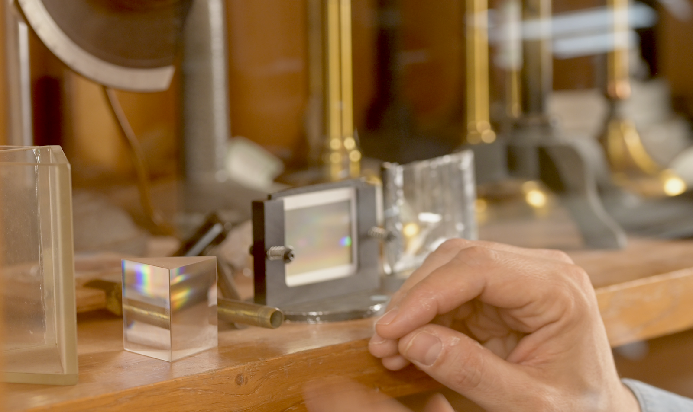
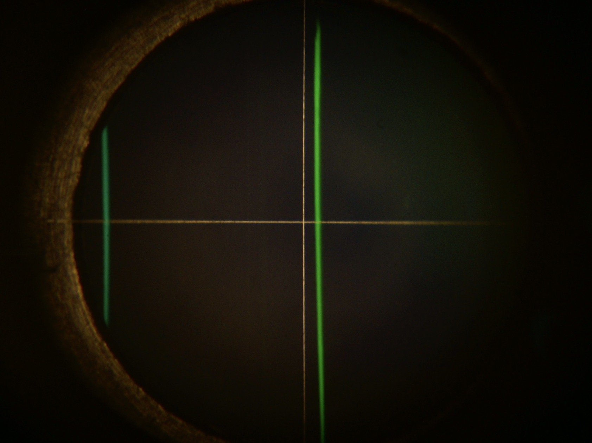
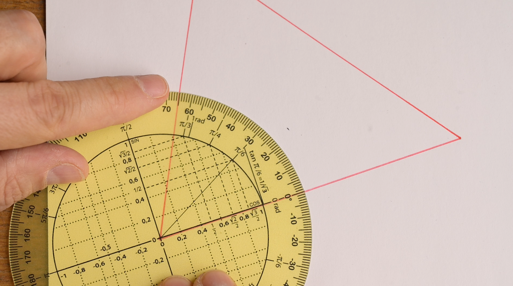

\

___

>1. [_Images d'une fente source à travers un réseau de diffraction_](#1)
>2. [_La formule fondamentale du réseau_](#2)
>3. [_Symétries des images diffractées au minimum de déviation_](#3)
>4. [_Comment se servir d'un goniomètre ?_](#4)

___
[^mn0]:
    {-}  En colorimétrie, on utilise différentes représentations du signal issu du capteur ou _scopes_, pour effectuer les corrections nécessaires à une reproduction consistante des couleurs.
[^mni1]:
     {-} Un goniomètre de type Bouty. De droite à gauche, on distingue : la fente source, le collimateur, le plateau et la lunette de visée.
[^mn3]:
    {-}  Un prisme ou un réseau de diffraction peuvent _séparer_ le mélange de lumières colorées issu d'une source polychromatique.
[^mn4]:
    {-}  Une lampe à vapeur de Mercure présente _un spectre de raies_.
[^mn11]:
    {-} Image de la fente source à travers le réseau _à l'ordre zéro_, dans la direction de la lumière incidente, mise au point à l'infini.
[^mn12]:
    {-} Images colorées de la fente source à travers le réseau _à l'ordre 1_, dans une direction différente de celle de la lumière incidente, mise au point à l'infini.
[^mn31]:
    {-} On fait varier _l'angle d'incidence_ $\theta_0$ en faisant tourner le réseau sur le plateau de bois. Pour une tâche de diffraction donnée, l'angle de déviation $D$ passe par un minimum $D_{min}$.
[^mn22]:
    {-} Dans la formule du réseau, les angles sont repérés par rapport à la normale $(N)$ au réseau.
[^mn23]:
    {-} Cas particulier de la composante verte de la lampe spectrale à vapeur de mercure. On considère l'image de la fente source à l'orde $p=-1$. C'est l'image que l'on peut observer à l'angle $\theta_{p=-1}$ repéré par rapport à la normale $(N)$ au réseau.
[^mn223]:
    {-} L'indication $300$ traits par mm permet de calculer une estimation de la valeur du pas du réseau.
[^mn24]:
    {-} $\theta_p$, mesuré par rapport à la normale $(N)$ est l'angle tel que définit dans la mise en place théorique. En pratique, on repère les angles par rapport à l'ordre zéro, et on définit l'angle de déviation $D_p$.
[^mn36]:
    {-}  
[^mn21]:
    {-} Mesurer un angle avec un rapporteur suppose bien de faire _deux visées_, pour déterminer _deux azimuts_ différents.
[^mn5]:
    {-}  Le _collimateur_ et la _lunette_ permettent de _viser_ avec précision.
[^mn6]:
    {-}  Un système mécanique _à deux vis_ permet de contrôler des _rotations très fines_ de la lunette.
[^mn7]:
    {-}  Un système mécanique _à deux vis_ permet de contrôler des _rotations très fines_ du plateau.
[^mn41]:
    {-}  _Visée_ de la raie verte dans l'ordre $p=-1$.
[^mn42]:
    {-}  _Visée_ de la raie verte dans l'ordre $p=+1$ de la situation symétrique, de l'autre côté de l'axe du collimateur.
[^mn43]:
    {-}  _Visée_ de la raie verte dans l'ordre $p=-1$.
[^mn44]:
    {-}  Image précédente _retournée_, comme _vue de dessous_.
[^mn45]:
    {-}  _Visée_ de la raie verte dans l'ordre $p=+1$ de la situation symétrique, de l'autre côté de l'axe du collimateur.
[^mn46]:
    {-} 
[^mn47]:
    {-} 

### Prologue

Pour un physicien, la lumière est un message duquel on peut extraire de nombreuses informations.

>[^mn0]

Déterminer avec précision la fréquence d'un rayonnement, sa couleur exacte, est le point de départ de nombreuses analyses, dans des champs d'application très variés.

Pour s'assurer d'une reproducion fidèle des couleurs en photographie ou en vidéo, par exemple, on effectue des _mesures physiques_ précises, tout le long de la chaîne de production, de la prise de vue à la projection finale.

### Introduction

>Un _goniomètre_ est un instrument de précision qui, comme le rapporteur des leçons de géométrie, sert à mesurer des angles. Si le rapporteur présente 90 graduations pour un angle droit, une graduation pour chaque degré, le goniomètre, lui, présente _60 fois plus_ de graduations, soit une graduation pour chaque _minute d'arc_.

[^mni1]

>[^mn3] On appellera _spectromètre_ l'ensemble d'instruments qui permet de séparer le faisceau issu d'une source de lumière _polychromatique_, c'est-à-dire considérée comme un mélange de lumières colorées, dans l'ensemble des lumières _monochromatiques_ ou lumières colorées pures qui constituent son _spectre_, et d'obtenir une mesure de leurs longueurs d'onde.
    
On pourra obtenir un spectromètre en associant le goniomètre avec un système dispersif comme le prisme qui _réfracte_ chaque rayon coloré selon un angle différent.
 
>[^mn4] 

On peut aussi utiliser un réseau qui _diffracte_ la lumière incidente dans des directions différentes et dans des ordres différents.

On a d'ailleurs pris l'habitude de classer les sources de lumière en fonction de la nature de leur spectre : une lampe blanche possède un spectre _continu_ alors que les lampes à vapeurs métalliques ont un spectre contenant un nombre _discret_ de raies, qui sont comme la _signature_ de l'élément chimique qui les a émis.

___

## 1 - Images d'une fente source à travers un réseau de diffraction {#1}

### Approche expérimentale 1 {#11}

La fente du collimateur est éclairée par une lampe spectrale à vapeur de mercure.

>En regardant, à travers le réseau, directement dans l'axe du collimateur, on peut voir une image de la fente source, très lumineuse, et dont la couleur gris-bleuté est celle du mélange issu de la lampe.

 [^mn11]

>En déportant le regard horizontalement, c'est à dire perpendiculairement à la direction des fentes du réseau, on peut voir d'autres images de la fente source, qui ont chacune une couleur pure, et dont l'ensemble constitue le _spectre de raies_ de la lampe au mercure.

 [^mn12]

En déportant le regard encore plus loin de l'axe optique, on peut observer d'autres images colorées de la fente former un second spectre. 

En séance de travaux pratiques, dans le noir, vous pourrez vérifier qu'il est même possible d'apercevoir un troisième spectre et d'observer des spectres des trois ordres de l'autre côté, du côté des ordres négatifs.

### Approche expérimentale 2

Dans cette nouvelle configuration, le réseau est placé sur un plateau. En faisant tourner le plateau, on peut faire varier l'angle sous lequel le réseau est éclairé. 

Le réseau est éclairé par le faisceau quasiment _monochromatique_ d'un laser.

 [^mn31]

Plus précisément, on fait varier l'angle d'incidence $\theta_0$ de manière _monotone_ entre zéro et 90 degrés puis de nouveau de manière _monotone_ entre 90 degrés et zéro.

>La tâche centrale reste immobile quel que soit l'angle d'incidence ; elle correspond à la partie de la lumière qui n'est pas déviée par le réseau.

>En revanche, les autres tâches de diffraction se rapprochent de la tâche centrale puis s'en éloignent. Autrement dit, leur distance à la tâche centrale _passe par un minimum_.

## 2 - La formule fondamentale du réseau {#2}

À partir de la loi de la réfraction dans le cas du prisme, ou à partir des principes de la diffraction dans le cas du réseau, on peut établir une expression mathématique, une formule, qui nous permet de _calculer_ les longueurs d'onde à partir des angles que l'on peut _mesurer_ directement.

La _formule fondamentale du réseau_, dont nous admettrons la validité dans une première approche, permet de déterminer les directions dans lesquelles on peut trouver les maxima d'éclairement, en fonction des autres grandeurs pertinentes.

[^mn22] 

$$ \sin(\theta)- \sin(\theta_0)=p\frac{\lambda}{a}$$ 

- $\theta_0$ représente _l'angle d'incidence_, angle sous lequel arrive la lumière issue du collimateur sur le réseau. Bien noter que cet angle est repéré par rapport à _la normale (N)_ au réseau ;

- _p_ est _l'ordre d'interférence_ considéré. C'est un entier relatif qui nous permet de numéroter les différentes images de la fente source d'une même couleur, les différentes raies du même vert par exemple ;

[^mn23] 

- $\theta_p$ représente l'angle sous lequel on peut repérer l'image de la fente source d'ordre p de la couleur considérée. Cet angle est également défini par rapport à la normale $(N)$ au réseau ; 

- $a$ est une grandeur qui caractérise le réseau particulier que l'on a utilisé. C'est la distance entre deux gravures successives (réseau = grating in english) ou _pas du réseau_. Elle est de l'ordre du micromètre. Dans la pratique, c'est l'inverse du pas qui est indiqué sur l'objet, _le nombre de traits par unité de longueur_, 300 traits par mm dans notre exemple.

 [^mn223]

- $\lambda$, enfin, est la longueur d'onde dans l'air du rayonnement considéré. Elle caractérise quantitativement la couleur de la raie. Dans notre exemple, la raie verte de la lampe à vapeur de Mercure possède une teinte absolument singulière, caractérisée par la longueur d'onde 576 nm.

### Angle de déviation D {#13}

Pour $p=0$, on peut remarquer que la formule fondamentale du réseau se réduit à : 
$$ \sin(\theta) = \sin(\theta_0)$$ $$\theta = \theta_0$$

Une partie de la lumière incidente n'est donc pas du tout déviée, quel que soit l'angle d'incidence et quelle que soit la longueur d'onde.

>L'image de la fente d'ordre zéro, que l'on peut voir directement dans l'axe du collimateur, a donc la même couleur que le _mélange_ directement issu de la source.

_En pratique_, nous allons repérer les différentes raies colorées par rapport à cet ordre zéro, direction que l'on peut viser à la lunette, plutôt que par rapport à la normale $(N)$ au réseau, qui est une direction dans laquelle on ne peut pas voir de lumière. 

On considèrera donc, dorénavant, la _déviation_ $D_p$ d'une raie colorée, grandeur mesurable, plutôt que son angle de sortie $\theta_p$ tel qu'il est défini dans la mise en place théorique de la formule fondamentale du réseau. 

Par construction, il vient : 
$$  D_p=\theta_p-\theta_0 $$

 [^mn24]
 
## 3 - Symétries des images diffractées au minimum de déviation {#3}

### Approche expérimentale

[^mn7]Sur le goniomètre, on peut faire varier l'angle d'incidence en faisant tourner le plateau sans toucher au réseau. Pour la raie de couleur considérée (raie verte) dans l'ordre considéré ($p=-1$), on cherche la position du plateau telle que la raie soit la plus "à gauche" possible, c'est à dire telle que sa déviation soit minimale.

En réglant ainsi l'angle d'incidence de manière **à se placer au minimum de déviation**, on découvre une situation qui présente des symétries remarquables.

 [^mn36]

- On peut tout d'abord remarquer que le plan du réseau se situe alors selon **la bissectrice** de l'angle formé par les directions du collimateur et de la lunette. Autrement dit, au minimun de déviation, l'angle d'incidence et l'angle de visée sont **égaux en valeur et opposés en signe**.

- On peut ensuite remarquer que l'on retrouve ce même angle entre la direction de la normale au réseau et la direction de la lumière qui n'est pas déviée dans _l'ordre zéro_. Autrement dit, **l'angle de déviation $D_{min}$** vaut alors exactement **moins deux fois** l'angle d'incidence.

Mesurer la _déviation minimale_ $D_{min}$ suffit donc à déterminer $\theta_0$ et $\theta$ géométriquement, _sans mesure supplémentaire_. L'expression permettant de calculer $\lambda$ se ramène alors à une fonction d'un seul angle et non plus de deux :

$$ \lambda = \frac{a}{p}[ \sin(\theta)- \sin(\theta_0)] $$
$$\theta=\frac{D_{min}}{2}=-\theta_o$$ 
$$ \lambda = \frac{a}{p}[\sin(\frac{D_{min}}{2})-\sin(\frac{-D_{min}}{2})] $$
$$ \lambda = 2\frac{a}{p}[\sin(\frac{D_{min}}{2})]$$

### Approche par l'exploration du modèle mathématique

En considérant la déviation $D = (\theta-\theta_0)$ plutôt que l'angle par rapport à la normale, l'équation fondamentale du réseau devient :
$$ \sin(\theta_0+D)=\sin(\theta_0)+p\frac{\lambda}{a}  $$
On cherche la dérivée de cette expression par rapport à $\theta_0$. 

Pour le membre de droite de l'égalité, il vient immédiatement :
$$ \frac{d(\sin\theta_0+p\frac{\lambda}{a})}{d\theta_0}=\cos\theta_0  $$

Pour le membre de gauche de l'égalité, comme :
$$ \sin(\theta_0+D)=\sin\theta_0 \cos D+ \cos\theta_0 \sin D $$

Il vient :

$\begin{multline*}
\frac{d(\sin(\theta_0+D))}{d\theta_0} = \cos(\theta_0) \cos(D)-\sin(\theta_0)\sin(D)\frac{dD}{d\theta_0} \\
-\sin(\theta_0) \sin(D)+\cos(\theta_0) \cos(D)\frac{dD}{d\theta_0} 
\end{multline*}$

$\begin{multline*}
\frac{d(\sin(\theta_0+D))}{d\theta_0} = \cos(\theta_0) \cos(D) (1+\frac{dD}{d\theta_0}) \\
-\sin(\theta_0) \sin(D) (1+\frac{dD}{d\theta_0}) 
\end{multline*}$

Et comme au minimum de déviation on a : $$ \frac{dD}{d\theta_0}=0 $$

L'égalité des deux membres s'écrit alors : 
$$ \cos\theta_0=\cos\theta_0 \cos D_{min}-\sin\theta_0 \sin D_{min}  $$

Ce qui permet d'aboutir à l'équation :
$$ \cos\theta_0=\cos(\theta_0+D_{min}) $$
Cette équation admet deux solutions.

La première solution, $D_{min}=0$, correspond à l'ordre zéro. 
La seconde correspond bien aux symétries décrites plus haut :

$$ D_{min}=-2\theta_0  $$

$$ \theta = - \theta_0 = \frac{D_{min}}{2} $$

## 4 - Comment se servir d'un goniomètre {#4}

### Analogie entre un rapporteur et un goniomètre

On pourrait dire qu'un goniomètre est comme le **rapporteur** des leçons de géométrie. Cette analogie va d'ailleurs nous permettre de préciser un point de méthode et un point de vocabulaire.

 [^mn21]

Remarquons tout d'abord que pour mesurer un angle, nous effectuons toujours **deux visées**. De la même manière que, sur un banc d'optique, on détermine toujours une distance en soustrayant **deux abscisses** ; sur un goniomètre, on détermine toujours un angle en soustrayant **deux azimuts**.

On écrira par exemple : $$\theta_1 = (\alpha_1-\alpha_0)$$ en réservant les lettres $\theta_i$ pour les angles et les lettres $\alpha_i$ pour les azimuts.

>Cette _distinction de vocabulaire_ nous permet de garder en tête que chaque mesure d'angle $\theta_1$ est "grosse" des **incertitudes expérimentales** que l'on peut attacher à chacune des _deux visées_ et à chacune des _deux lectures d'azimuts_ $\alpha_1$ et $\alpha_2$. 

### Différences entre un rapporteur et un goniomètre

Si le rapporteur présente bien 90 graduations pour un angle droit, 360 graduations pour un tour complet, le goniomètre, lui, présente ... **60 fois plus de graduations** ! Non pas une graduation pour chaque degré mais une graduation pour chaque minute d'arc. Commercialement, ces instruments sont dits **30 secondes**, comme la _demie-étendue_ que l'on peut associer à la lecture des graduations.

<figure class="fullwidth">

 La graduation mobile ou _vernier_ permet une lecture  des _azimuts_ en degrés et en minutes d'angle.

</figure>

[^mn5] Pour justifier une telle ambition, le goniomètre est équipé d'un **système de visée de précision** qui est constitué d'une **partie optique** (le _collimateur_ et la _lunette_) et d'une **partie mécanique**. On distinguera la _vis de serrage_, que l'on désserre pour effectuer des mouvements grossiers avant de la ressérer, et la _vis de déplacement micrométrique_ qui permet le déplacement fin de la lunette.[^mn6]

[^mn7] On notera l'existence d'un système mécanique similaire sur le plateau du goniomètre. Une vis de serrage permet des mouvements grossiers et, une fois cette dernière ressérée, la vis de déplacement micrométrique permet de contrôler des mouvements fins de rotation du plateau.

### Comment se servir du goniomètre, le protocole

La manière dont il faut se servir du goniomètre répond, bien entendu, au souci d'effectuer les mesures les plus précises possibles.
 
 ___

_Protocole_ 

En résumé, il y a quatre étapes à répéter pour chaque mesure.

1. **Déplacer grossièrement la lunette** pour visualiser l'ordre d'interférence considéré.

2. **Régler l'angle d'incidence** dans la situation particulière du minimum de déviation, beaucoup plus de détails sur ce sujet dans un instant.

3. **Viser la raie considérée** le plus précisément possible.

4. **Faire la lecture de l'azimut** correspondant, le relever et le faire apparaître dans son compte-rendu.

___

### Bilan

La formule fondamentale du réseau nous montre que pour calculer la longueur d'onde $\lambda$, il nous faut en pratique faire la  mesure  de _deux angles_ : l'angle d'incidence $\theta_o$ et l'angle $\theta$ auquel est diffractée la lumière colorée considérée dans l'ordre d'interférence $p$ considéré :
 
$$ \lambda = \frac{a}{p}[ \sin(\theta)- \sin(\theta_0)] $$

L'incertitude expérimentale attachée à la connaissance de $\lambda$ se calculerait donc, _a priori_, à partir de celles attachées à quatre déterminations d'azimuts $\alpha_i$ :

$$ \lambda = \frac{a}{p}[ \sin(\alpha_6-\alpha_5)- \sin(\alpha_4-\alpha_3)] $$

En nous plaçant au minimum de déviation, nous avons de moitié le nombre d'angles à mesurer pour calculer $\lambda$ :

$$ \lambda = 2\frac{a}{p} [\sin(\frac{D_{min}}{2})] $$

On cherchera ensuite à exprimer $D_{min}$ en fonction des azimuts $\alpha_1$ et $\alpha_0$  qui sont les grandeurs mesurés directement et auxquelles on peut attacher des incertitudes expérimentales.

$$ \lambda = 2\frac{a}{p} \sin(\vert \frac{\alpha_0-\alpha_1}{2} \vert) $$

En faisant l'économie de la mesure de l'angle d'incidence, nous avons fait _l'économie des incertitudes qui sont attachées_ à la détermination des deux azimuts correspondants.

## Pour conclure

Apprendre à se servir du goniomètre c'est donc réaliser que la précision de la détermination d'une longueur d'onde dépend non seulement de la **précision de la visée** et de **la précision de la lecture de l'azimut** mais également du _prototocole_, c'est à dire de la _manière dont on conduit les mesures_. 

On a ainsi chercher à exploiter au mieux _les symétries du phénomène physique_ mis en jeu, en s'aidant notamment pour cela des symétries du modèle mathématique fourni.

___

## Prolongement: symétrie de la situation de mesure
### Approche expérimentale

Il est légitime de demander à notre _modèle physique_ de rester pertinent que l'on regarde le phénomène depuis **le haut** ... ou bien qu'on le regarde depuis **le bas**.

Il existe donc nécessairement une position symétrique du réseau et de la lunette qui réalise exactement la même configuration angulaire ... de l'autre côté du goniomètre.

___

 _Protocole_ [^mn41] [^mn42]

 Résumé en trois étapes, nous allons :

1. **Viser la raie** verte dans l'ordre $p=-1$ et déterminer son azimut $\alpha_1$ au minimum de déviation ; 

2. Déplacer le réseau, **par rotation du plateau**, approximativement dans la position symétrique à la précédente par rapport à l'axe qui est la  direction de la lumière incidente ;

3. **Viser la même raie une seconde fois**, mais dans l'ordre $p=+1$ de cette nouvelle configuration et déterminer son azimut $\alpha_2$ au minimum de déviation.

___

On obtient donc :

$$ \lambda = 2\frac{a}{p} \sin(\frac{(2D_{min}/2)}{2}) $$

On cherchera ici également à exprimer $\lambda$ en fonction des azimuts $\alpha_1$ et $\alpha_2$  qui sont les grandeurs mesurés directement et auxquelles on pourra attacher des incertitudes  :

$$ \lambda = 2\frac{a}{p} \sin(\vert \frac{\alpha_2-\alpha_1}{4} \vert)$$

**Bilan** : en effectuant les deux visées, nous avons cette fois déterminé l'angle $(2D_{min})$. L'incertitude expérimentale attachée à la détermination de l'angle $D_{min}$  est donc divisée par deux !

### Approche par l'exploration du modèle mathématique

La transformation mathématique [^mn43] [^mn44] [^mn45] qui correspond au changement de point de vue haut/bas peut être vue comme un retournement de l'image, une rotation d'un demi-tour autour de l'axe qui est vertical sur la feuille et passe par son milieu.

En gardant la même convention d'orientation des angles, cette transformation :

- conserve _en norme_ les valeurs des angles $\theta_0$ et $\theta$,

- change l'ordre $p=-1$ en un ordre $p=+1$,

- change l'angle $\theta_0$ en $-\theta_0$

- et change l'angle $\theta$ en $-\theta$.

$$ \sin(-\theta) - \sin(-\theta_0) = (-p)\frac{\lambda}{a} $$

Vous noterez que l'invariance observée est traduite, dans le modèle mathématique, par la propriété de la fonction sinus d'être une _fonction impaire_, c'est à dire telle que : 
$$ \sin(-x) = - \sin(x)$$

Les angles correspondant à la situation symétrique vérifient donc bien la formule fondamentale du réseau avec les mêmes valeurs :
$$ \sin(\theta) - \sin(\theta_0) = p\frac{\lambda}{a} $$

___

### Bilan :

En effectuant la mesure symétrique, nous avons de nouveau divisé par deux le facteur devant les grandeurs auxquelles on attache une incertitude expérimentale de mesure :

$$ \lambda = 2\frac{a}{p} \sin(\frac{(2D_{min}/2)}{2}) = 2\frac{a}{p} \sin(\vert \frac{\alpha_2-\alpha_1}{4} \vert)$$

Soit au total un gain de l'ordre de 1 à 4.

___

Dans le [prochaine épisode](/SspectroE02.html), nous nous intéresserons au problème de la précision des visées. 

En particulier, nous traiterons de la manière dont on règle à sa vue l'ensemble lunette et collimateur.

Au revoir, et à très bientôt j'espère.
