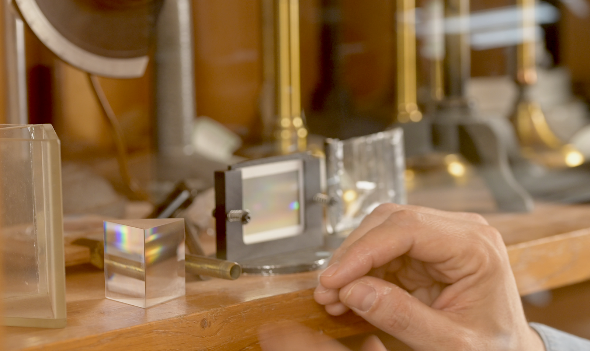
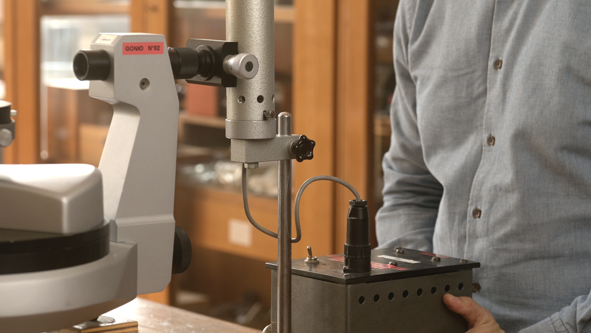
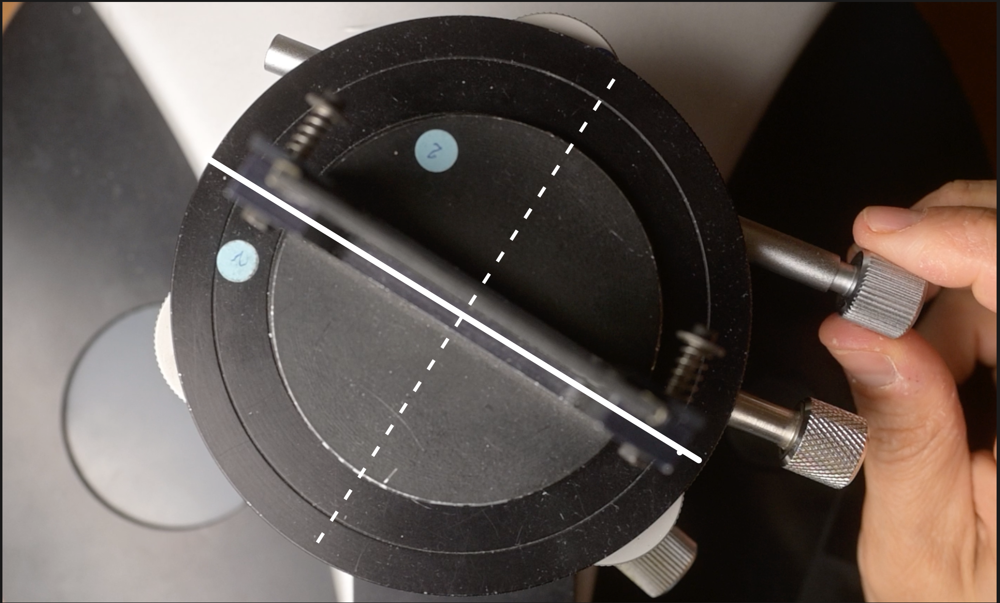
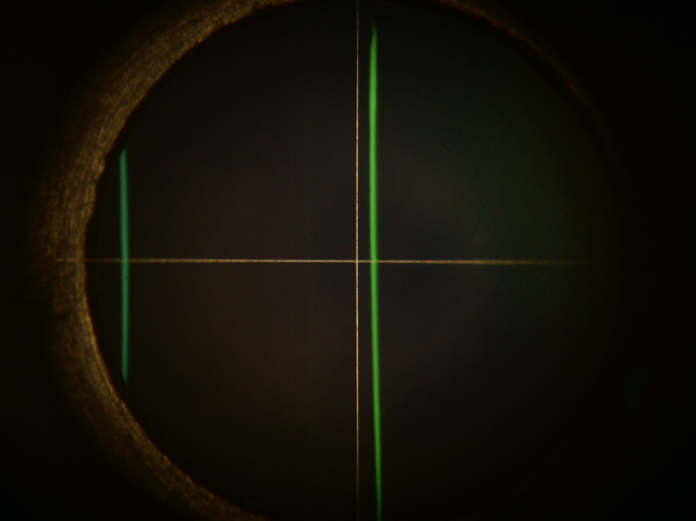
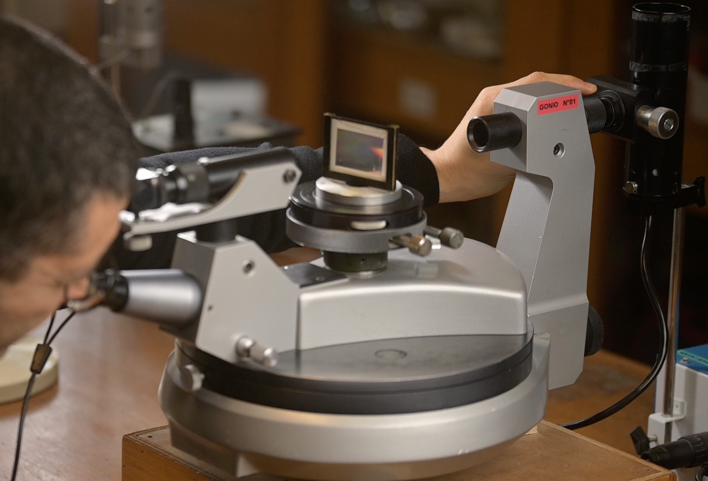
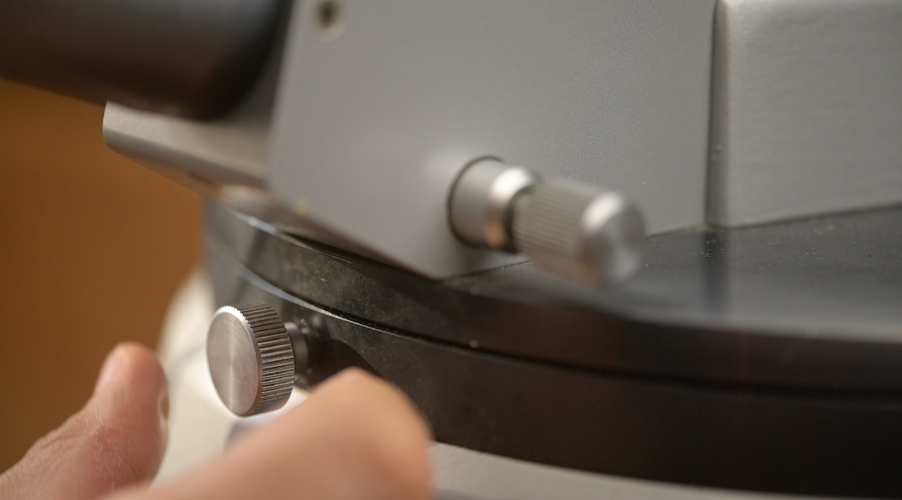
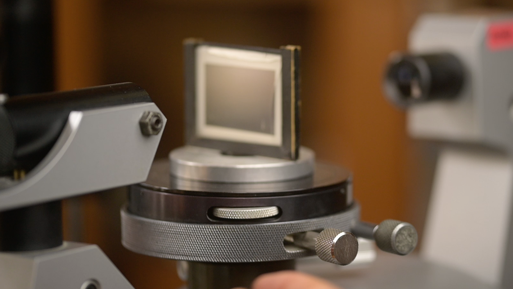
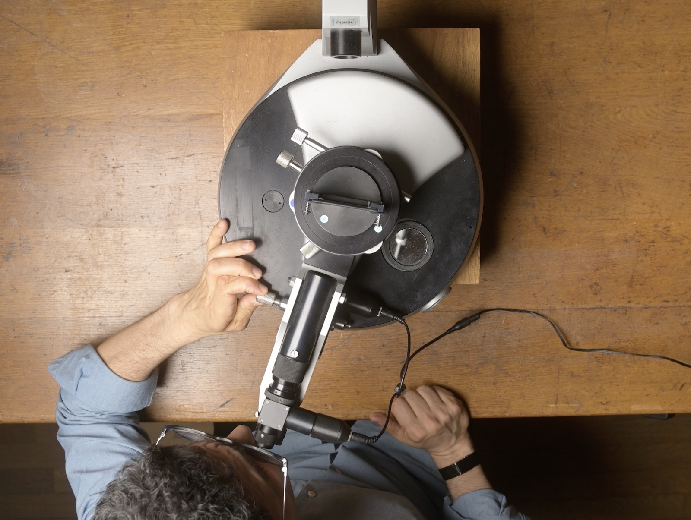
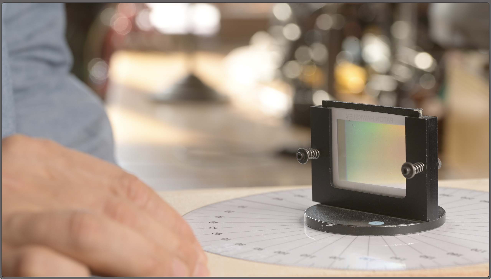

\

___

>1. [_Images d'une fente source à travers un réseau de diffraction_](#1)
>2. [_La formule fondamentale du réseau_](#2)
>3. [_Symétries des images diffractées au minimum de déviation_](#3)
>4. [_Comment se servir d'un goniomètre ?_](#4)

___
[^mn0]:
    {-}  En colorimétrie, on utilise différentes représentations du signal issu du capteur ou _scopes_, pour effectuer les corrections nécessaires à une reproduction consistante des couleurs.
[^mni1]:
     {-} Un goniomètre de type Bouty. De droite à gauche, on distingue : la fente source, le collimateur, le plateau et la lunette de visée.
[^mn3]:
    {-}  Un prisme ou un réseau de diffraction peuvent _séparer_ le mélange de lumières colorées issu d'une source polychromatique.
[^mn4]:
    {-}  Une lampe à vapeur de Mercure présente _un spectre de raies_.
[^mn11]:
    {-} Image de la fente source à travers le réseau _à l'ordre zéro_, dans la direction de la lumière incidente, mise au point à l'infini.
[^mn12]:
    {-} Images colorées de la fente source à travers le réseau _à l'ordre 1_, dans une direction différente de celle de la lumière incidente, mise au point à l'infini.
[^mn31]:
    {-} On fait varier _l'angle d'incidence_ $\theta_0$ en faisant tourner le réseau sur le plateau de bois. Pour une tâche de diffraction donnée, l'angle de déviation $D$ passe par un minimum $D_{min}$.
[^mn22]:
    {-} Dans la formule du réseau, les angles sont repérés par rapport à la normale $(N)$ au réseau.
[^mn23]:
    {-} Cas particulier de la composante verte de la lampe spectrale à vapeur de mercure. On considère l'image de la fente source à l'orde $p=-1$. C'est l'image que l'on peut observer à l'angle $\theta_{p=-1}$ repéré par rapport à la normale $(N)$ au réseau.
[^mn223]:
    {-} L'indication $300$ traits par mm permet de calculer une estimation de la valeur du pas du réseau.
[^mn24]:
    {-} $\theta_p$, mesuré par rapport à la normale $(N)$ est l'angle tel que définit dans la mise en place théorique. En pratique, on repère les angles par rapport à l'ordre zéro, et on définit l'angle de déviation $D_p$.
[^mn36]:
    {-}  
[^mn21]:
    {-} Mesurer un angle avec un rapporteur suppose bien de faire _deux visées_, pour déterminer _deux azimuts_ différents.
[^mn5]:
    {-}  Le _collimateur_ et la _lunette_ permettent de _viser_ avec précision.
[^mn6]:
    {-}  Un système mécanique _à deux vis_ permet de contrôler des _rotations très fines_ de la lunette.
[^mn7]:
    {-}  Un système mécanique _à deux vis_ permet de contrôler des _rotations très fines_ du plateau.
[^mn41]:
    {-}  _Visée_ de la raie verte dans l'ordre $p=-1$.
[^mn42]:
    {-}  _Visée_ de la raie verte dans l'ordre $p=+1$ de la situation symétrique, de l'autre côté de l'axe du collimateur.
[^mn43]:
    {-}  _Visée_ de la raie verte dans l'ordre $p=-1$.
[^mn44]:
    {-}  Image précédente _retournée_, comme _vue de dessous_.
[^mn45]:
    {-}  _Visée_ de la raie verte dans l'ordre $p=+1$ de la situation symétrique, de l'autre côté de l'axe du collimateur.
[^mn46]:
    {-} 
[^mn47]:
    {-} 

## Prolongement: symétrie de la situation de mesure
### Approche expérimentale

Il est légitime de demander à notre _modèle physique_ de rester pertinent que l'on regarde le phénomène depuis **le haut** ... ou bien qu'on le regarde depuis **le bas**.

Il existe donc nécessairement une position symétrique du réseau et de la lunette qui réalise exactement la même configuration angulaire ... de l'autre côté du goniomètre.

___

 _Protocole_ [^mn41] [^mn42]

 Résumé en trois étapes, nous allons :

1. **Viser la raie** verte dans l'ordre $p=-1$ et déterminer son azimut $\alpha_1$ au minimum de déviation ; 

2. Déplacer le réseau, **par rotation du plateau**, approximativement dans la position symétrique à la précédente par rapport à l'axe qui est la  direction de la lumière incidente ;

3. **Viser la même raie une seconde fois**, mais dans l'ordre $p=+1$ de cette nouvelle configuration et déterminer son azimut $\alpha_2$ au minimum de déviation.

___

On obtient donc :

$$ \lambda = 2\frac{a}{p} \sin(\frac{(2D_{min}/2)}{2}) $$

On cherchera ici également à exprimer $\lambda$ en fonction des azimuts $\alpha_1$ et $\alpha_2$  qui sont les grandeurs mesurés directement et auxquelles on pourra attacher des incertitudes  :

$$ \lambda = 2\frac{a}{p} \sin(\vert \frac{\alpha_2-\alpha_1}{4} \vert)$$

**Bilan** : en effectuant les deux visées, nous avons cette fois déterminé l'angle $(2D_{min})$. L'incertitude expérimentale attachée à la détermination de l'angle $D_{min}$  est donc divisée par deux !

### Approche par l'exploration du modèle mathématique

La transformation mathématique [^mn43] [^mn44] [^mn45] qui correspond au changement de point de vue haut/bas peut être vue comme un retournement de l'image, une rotation d'un demi-tour autour de l'axe qui est vertical sur la feuille et passe par son milieu.

En gardant la même convention d'orientation des angles, cette transformation :

- conserve _en norme_ les valeurs des angles $\theta_0$ et $\theta$,

- change l'ordre $p=-1$ en un ordre $p=+1$,

- change l'angle $\theta_0$ en $-\theta_0$

- et change l'angle $\theta$ en $-\theta$.

$$ \sin(-\theta) - \sin(-\theta_0) = (-p)\frac{\lambda}{a} $$

Vous noterez que l'invariance observée est traduite, dans le modèle mathématique, par la propriété de la fonction sinus d'être une _fonction impaire_, c'est à dire telle que : 
$$ \sin(-x) = - \sin(x)$$

Les angles correspondant à la situation symétrique vérifient donc bien la formule fondamentale du réseau avec les mêmes valeurs :
$$ \sin(\theta) - \sin(\theta_0) = p\frac{\lambda}{a} $$

___

### Bilan :

En effectuant la mesure symétrique, nous avons de nouveau divisé par deux le facteur devant les grandeurs auxquelles on attache une incertitude expérimentale de mesure :

$$ \lambda = 2\frac{a}{p} \sin(\frac{(2D_{min}/2)}{2}) = 2\frac{a}{p} \sin(\vert \frac{\alpha_2-\alpha_1}{4} \vert)$$

Soit au total un gain de l'ordre de 1 à 4.

___

Dans le [prochaine épisode](/SspectroE02.html), nous nous intéresserons au problème de la précision des visées. 

En particulier, nous traiterons de la manière dont on règle à sa vue l'ensemble lunette et collimateur.

Au revoir, et à très bientôt j'espère.
