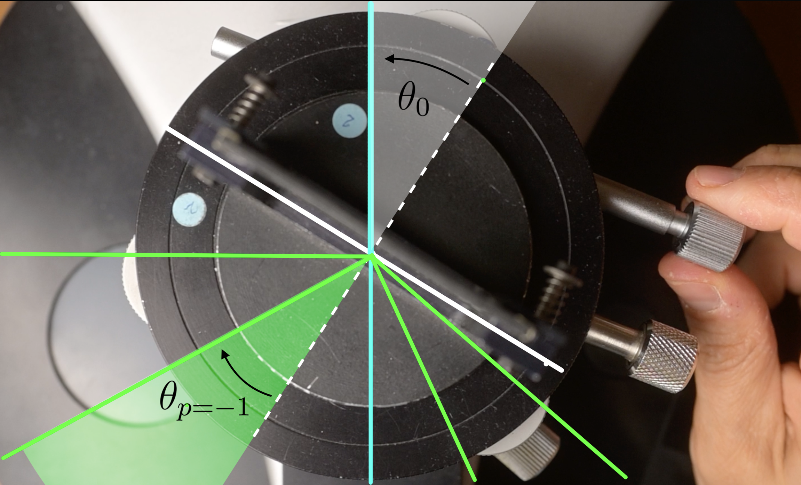

\

___

>1. [_Images d'une fente source à travers un réseau de diffraction_](#1)
>2. [_La formule fondamentale du réseau_](#2)
>3. [_Symétries des images diffractées au minimum de déviation_](#3)
>4. [_Comment se servir d'un goniomètre ?_](#4)

___
[^mn0]:
    {-}  En colorimétrie, on utilise différentes représentations du signal issu du capteur ou _scopes_, pour effectuer les corrections nécessaires à une reproduction consistante des couleurs.
[^mni1]:
     {-} Un goniomètre de type Bouty. De droite à gauche, on distingue : la fente source, le collimateur, le plateau et la lunette de visée.
[^mn3]:
    {-}  Un prisme ou un réseau de diffraction peuvent _séparer_ le mélange de lumières colorées issu d'une source polychromatique.
[^mn4]:
    {-}  Une lampe à vapeur de Mercure présente _un spectre de raies_.
[^mn11]:
    {-} Image de la fente source à travers le réseau _à l'ordre zéro_, dans la direction de la lumière incidente, mise au point à l'infini.
[^mn12]:
    {-} Images colorées de la fente source à travers le réseau _à l'ordre 1_, dans une direction différente de celle de la lumière incidente, mise au point à l'infini.
[^mn31]:
    {-} On fait varier _l'angle d'incidence_ $\theta_0$ en faisant tourner le réseau sur le plateau de bois. Pour une tâche de diffraction donnée, l'angle de déviation $D$ passe par un minimum $D_{min}$.
[^mn22]:
    {-} Dans la formule du réseau, les angles sont repérés par rapport à la normale $(N)$ au réseau.
[^mn23]:
    {-} Cas particulier de la composante verte de la lampe spectrale à vapeur de mercure. On considère l'image de la fente source à l'orde $p=-1$. C'est l'image que l'on peut observer à l'angle $\theta_{p=-1}$ repéré par rapport à la normale $(N)$ au réseau.
[^mn223]:
    {-} L'indication $300$ traits par mm permet de calculer une estimation de la valeur du pas du réseau.
[^mn24]:
    {-} $\theta_p$, mesuré par rapport à la normale $(N)$ est l'angle tel que définit dans la mise en place théorique. En pratique, on repère les angles par rapport à l'ordre zéro, et on définit l'angle de déviation $D_p$.
[^mn36]:
    {-}  
[^mn21]:
    {-} Mesurer un angle avec un rapporteur suppose bien de faire _deux visées_, pour déterminer _deux azimuts_ différents.
[^mn5]:
    {-}  Le _collimateur_ et la _lunette_ permettent de _viser_ avec précision.
[^mn6]:
    {-}  Un système mécanique _à deux vis_ permet de contrôler des _rotations très fines_ de la lunette.
[^mn7]:
    {-}  Un système mécanique _à deux vis_ permet de contrôler des _rotations très fines_ du plateau.
[^mn41]:
    {-}  _Visée_ de la raie verte dans l'ordre $p=-1$.
[^mn42]:
    {-}  _Visée_ de la raie verte dans l'ordre $p=+1$ de la situation symétrique, de l'autre côté de l'axe du collimateur.
[^mn43]:
    {-}  _Visée_ de la raie verte dans l'ordre $p=-1$.
[^mn44]:
    {-}  Image précédente _retournée_, comme _vue de dessous_.
[^mn45]:
    {-}  _Visée_ de la raie verte dans l'ordre $p=+1$ de la situation symétrique, de l'autre côté de l'axe du collimateur.

## 2 - La formule fondamentale du réseau {#2}

À partir de la loi de la réfraction dans le cas du prisme, ou à partir des principes de la diffraction dans le cas du réseau, on peut établir une expression mathématique, une formule, qui nous permet de _calculer_ les longueurs d'onde à partir des angles que l'on peut _mesurer_ directement.

La _formule fondamentale du réseau_, [^mn22] dont nous admettrons la validité dans une première approche, permet de déterminer les directions dans lesquelles on peut trouver les maxima d'éclairement, en fonction des autres grandeurs pertinentes.

$$ \sin(\theta)- \sin(\theta_0)=p\frac{\lambda}{a}$$ 

- $\theta_0$ représente _l'angle d'incidence_, angle sous lequel arrive la lumière issue du collimateur sur le réseau. Bien noter que cet angle est repéré par rapport à _la normale (N)_ au réseau ;

- _p_ est _l'ordre d'interférence_ considéré. C'est un entier relatif qui nous permet de numéroter les différentes images de la fente source d'une même couleur, les différentes raies du même vert par exemple ;

[^mn23] 

- $\theta_p$ représente l'angle sous lequel on peut repérer l'image de la fente source d'ordre p de la couleur considérée. Cet angle est également défini par rapport à la normale $(N)$ au réseau ; 

- $a$ est une grandeur qui caractérise le réseau particulier que l'on a utilisé. C'est la distance entre deux gravures successives (réseau = grating in english) ou _pas du réseau_. Elle est de l'ordre du micromètre. Dans la pratique, c'est l'inverse du pas qui est indiqué sur l'objet, _le nombre de traits par unité de longueur_, 300 traits par mm dans notre exemple.

 [^mn223]

- $\lambda$, enfin, est la longueur d'onde dans l'air du rayonnement considéré. Elle caractérise quantitativement la couleur de la raie. Dans notre exemple, la raie verte de la lampe à vapeur de Mercure possède une teinte absolument singulière, caractérisée par la longueur d'onde 576 nm.

### Angle de déviation D {#13}

Pour $p=0$, on peut remarquer que la formule fondamentale du réseau se réduit à : 
$$ \sin(\theta) = \sin(\theta_0)$$ $$\theta = \theta_0$$

Une partie de la lumière incidente n'est donc pas du tout déviée, quel que soit l'angle d'incidence et quelle que soit la longueur d'onde.

>L'image de la fente d'ordre zéro, que l'on peut voir directement dans l'axe du collimateur, a donc la même couleur que le _mélange_ directement issu de la source.

_En pratique_, nous allons repérer les différentes raies colorées par rapport à cet ordre zéro, direction que l'on peut viser à la lunette, plutôt que par rapport à la normale $(N)$ au réseau, qui est une direction dans laquelle on ne peut pas voir de lumière. 

On considèrera donc, dorénavant, la _déviation_ $D_p$ d'une raie colorée, grandeur mesurable, plutôt que son angle de sortie $\theta_p$ tel qu'il est défini dans la mise en place théorique de la formule fondamentale du réseau. 

Par construction, il vient : 
$$  D_p=\theta_p-\theta_0 $$

 [^mn24]
 
## 3 - Symétries des images diffractées au minimum de déviation {#3}

